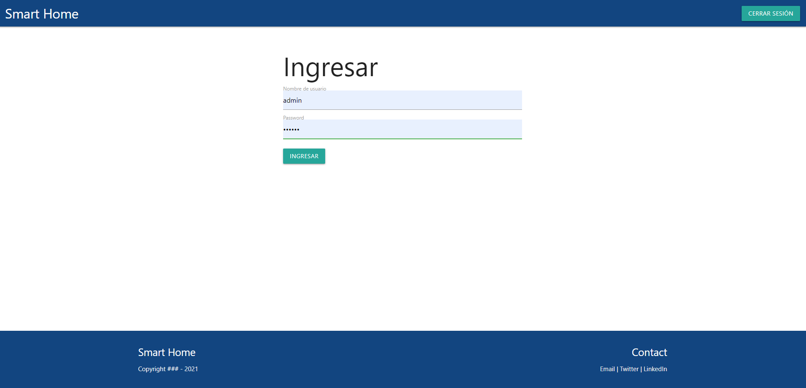
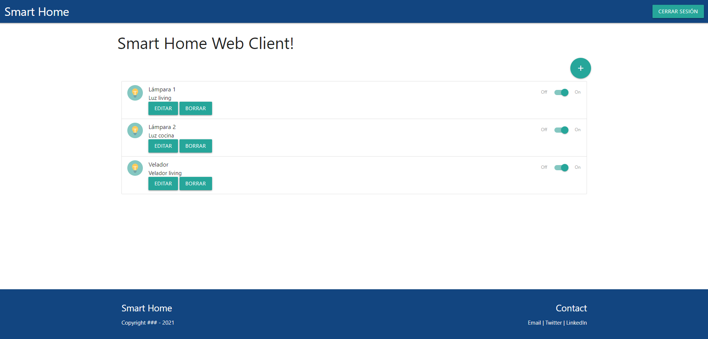

# Web App Full Stack Base

Este proyecto es una aplicación web fullstack que se ejecuta sobre el ecosistema `Docker`. Está compuesta por un compilador de `TypeScript` que te permite utilizar este superset de JavaScript para poder programar un `cliente web`. También tiene un servicio en `NodeJS` que te permite ejecutar código en backend y al mismo tiempo disponibilizar el código del cliente web para interactar con el servicio. Además tiene una `base de datos` MySQL que puede interactuar con el backend para guardar y consultar datos, y de manera adicional trae un `administrador` de base de datos para poder administrar la base en caso que lo necesites.

La aplicación IoT de base que viene con este proyecto se encarga de crear una tabla llamada `Devices` en la base de datos cuando se agregan dispositivos en un hogar inteligente - _como pueden ser luces, TVs, ventiladores, persianas, enchufes y otros_.

## Descripción 🚀

La aplicación comienza con una autorización de inicio de sesión, en donde se puede ingresar con los siguientes datos.

`USER:` admin

`PASS:` 123456

En la esquina superior derecha, se encuentra un botón de cierre de sesión, que se puede utilizar en cualquier caso.

Una vez ingresada la sesión, se muestra en una lista los dispositivos disponibles. Con un switch ubicado a la derecha se puede encender o apagar cada uno individualmente.

Pueden agregarse dispositivos nuevos cliqueando el botón `+` en la esquina superior derecha. Además, pueden eliminarse y editarse cada dispositivo cliqueando en los botones `EDITAR` y `BORRAR` respectivamente.

Cada cambio es permanente y se envía la información al backend en formato JSON, quien se encarga de mantener las modificaciones y editar la base de datos. Esto quiere decir que aunque se cierre la sesión, los cambios quedarán guardados.
